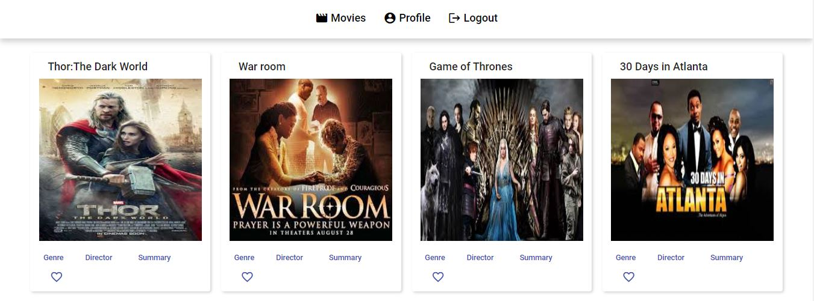

# MyFlixAngularClient

This project was generated with [Angular CLI](https://github.com/angular/angular-cli) version 14.2.4.
It is an app that consumes a movie REST api, and displays movies.

## Live Demo

[Live Demo Link](https://livedemo.com)

## Development server

Run `ng serve` for a dev server. Navigate to `http://localhost:4200/`. The application will automatically reload if you change any of the source files.

## Code scaffolding

Run `ng generate component component-name` to generate a new component. You can also use `ng generate directive|pipe|service|class|guard|interface|enum|module`.

## Build

Run `ng build` to build the project. The build artifacts will be stored in the `dist/` directory.

## Running unit tests

Run `ng test` to execute the unit tests via [Karma](https://karma-runner.github.io).

## Running end-to-end tests

Run `ng e2e` to execute the end-to-end tests via a platform of your choice. To use this command, you need to first add a package that implements end-to-end testing capabilities.

## Key Features

- Welcome page where users can either log in or register
- A movie page where user can view all movies once authenticated
- Upon clicking on a particular movie, users will be taken to a single movie view, where
  additional movie details will be displayed. The single movie view will contain the following
  additional features:
  - A button that when clicked takes a user to the director view, where details about the
    director of that particular movie will be displayed.
  - A button that when clicked takes a user to the genre view, where details about that
    particular genre of the movie will be displayed.

## Technical Requirements

- Written in Angular (version 9 or later)
- The application requires the latest version of Node.js and npm package
- The application must contain user registration and login forms
- The application must be designed using Angular Material
- The application's codebase must contain comments using Typedoc
- The project must contain technical documentation using JSDoc
- The project must be hosted on GitHub Pages

## Author

👤 **Tommy Tabe**

- Github: [@tabetommy](https://github.com/tabetommy)
- Twitter: [@twitterhandle](https://twitter.com/twitterhandle)
- Linkedin: [Tommy egbe](https://www.linkedin.com/in/tommy-egbe-304464116/)

## 🤝 Contributing

Contributions, issues and feature requests are welcome!

Feel free to check the [issues page](issues/).